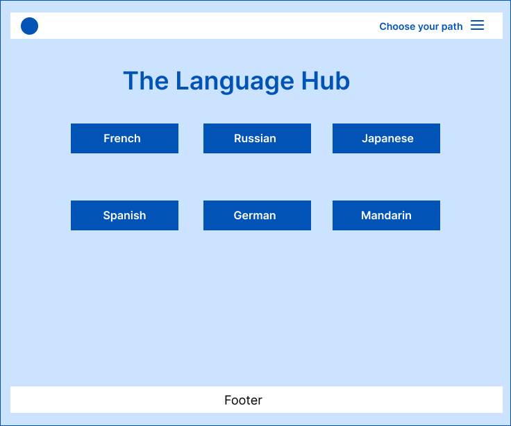
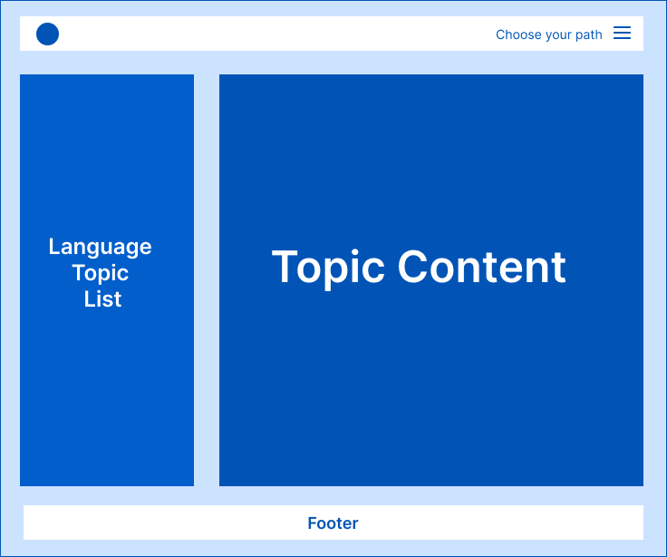

# Contributing

You are more than welcome to contribute to this project. As a matter of fact you are encouraged to, because at the end of the day, this is **your** project

## What We Are Aiming For

#### Home Page



#### Detail Page



---

## Project Structure

### Technologies

- [Next.js](https://nextjs.org)
- [TailwindCSS](tailwindcss.com/)
- [Chakra UI](https://chakra-ui.com/)
- [FontAwesome](https://fontawesome.com/)
- [Markdown](https://nextjs.org)
- [next-mdx-remote](https://github.com/hashicorp/next-mdx-remote)
- [next-seo](https://github.com/garmeeh/next-seo)

### Files and Folders

```
.
├── learn/
│   ├── french
│   ├── japanese
│   └── ...
├── public/
│   └── images
├── src/
│   ├── components/
│   │   ├── LangPathNav.jsx
│   │   ├── Meta.js
│   │   ├── NavDropDown.jsx
│   │   └── Sidebar.jsx
│   ├── layouts/
│   │   ├── Footer.jsx
│   │   ├── Header.jsx
│   │   ├── PageWrapper.jsx
│   │   └── Wrapper.jsx
│   ├── pages/
│   │   ├── [langPath]/
│   │   │   └── [slug].jsx
│   │   ├── _app.js
│   │   ├── _document.js
│   │   ├── 404.jsx
│   │   ├── about.jsx
│   │   └── index.jsx
│   ├── styles/
│   │   └── globals.css
│   └── utils/
│       ├── _menuLookup.js
│       ├── helpers.js
│       ├── langLogos.js
│       └── langMenus.js
├── CODE_OF_CONDUCT.md
├── CONTRIBUTION.md
├── Detail.png
├── Home.png
├── jsconfig.json
├── LICENSE
├── next-seo.config.js
├── package-lock.json
├── package.json
├── postcss.config.js
├── README.md
└── tailwind.config.js
```

- **compoments**: contains component files for items that will aid in the working of the site.
  - `LangPathNav.jsx`: This is the language path component rendered on the detail page of a selected language
  - `Meta.js`: The meta component for `next-seo` options
  - `NavDropDown.jsx`: The dropdown on the navigation that lists all the languages currently availabel
  - `Sidebar.jsx`: A sidebar that lists all the topics in a selected language in the detail view
- **learn**: where the language source files are
- **pages**: pages for the site
  - `index.js`: the home page
  - `/[langPath]/[slug].js`: the page for detail view
  - `about.js`: the about page of the site
  - `404.js`: the not found page
- **public**: assets for the site
  - static: where static assets are
- **src**:
  - **layouts**: files relating to site layout
    - `Header.jsx`: header component
    - `Footer.jsx`: footer component
    - `PageWrapper.jsx`: an additonal wrapper for all pages except the `[slug].js` one
    - `Wrapper.jsx`: Overall wrapper for the site. It wraps `_app.js`
  - **utils**: utility files for
    - `_menuLookup.js`: this is the lookup to render the sidebar items
    - `langLogos.js`: the country logos for the dropdown
    - `langMenus.js`: The language menus to be use in `_menuLookup`
- **styles**: style import for the site
  - `globals.css`: extracted utiliy classes to make jsx files a bit cleaner

---

## How to Contribute

Data rendered on the site is from markdown files located in the `learn` folder in the root of the project.

### Adding Language Files

- Currently there are files for French, Shona and Russian.
- To add to the existing languages, either modify the exisiting file or create a new `.md` file in the appropriate folder
- To add a new language, create a folder in the `learn` directory with the language

```
├── learn
│   ├── french
│   │   ├── basics.md
│   ├── russian
│   │   ├── basic.md
│   ├── [your language]
│   │   ├── [your-file].md
```

For the `.md` files, please make sure the frontmater follows this pattern:

```yml
---
title: French Basics
topic: french
excerpt: An introduction to the French language
part: 01
---
```

After you have added your files, send in your pull request and I will hadle the rest. Or you can add the options for your added language in the following places

In the `langMenus.js` file:

```js
// src/utils/langMenus.js
export const frenchMenu = ["Basics", "Pronouns", "Verbs"];
export const russianMenu = ["Basics", "Nouns"];
export const shonaMenu = ["Basics"];
```

In the `_menuLookup.js` file:

```js
// src/utils/_menuLookup.js
import { frenchMenu, russianMenu, shonaMenu } from "./langMenus";

export const _menuLookup = (langPath) => {
	const lang = langPath.toLowerCase();

	if (lang === "french") return frenchMenu;
	else if (lang === "russian") return russianMenu;
	else if (lang === "shona") return shonaMenu;
	return null;
};
```

---

## Improving Code

By no means is the code optimal. Feel free to improve it in any way you think would improve it.

So **Pull Request** away! Just mention me on Twitter when you do so I get to your requests as soon as possible. [@Psypher1](https://twitter.com/Psypher1)

## Spread the word

Sharing is caring. Share this resource with anyone you think would be interested. The more people that add to it, the better it will be.

# AGAIN, THANK YOU
